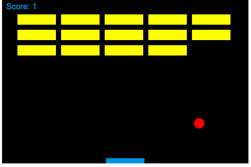

# Breakout!
> Short blurb about what your product does.

This is a re-creation of the classic arcade game "Breakout" or "Arkanoid" to better understand 2d collision dectection and frame animation for JavaScript.

This is an HTML file with minimal css (contained in the head of the doc) and JavaScript. The user should recognize the game, but if not you will have to use your arrow keys to move a paddle left and right of the screen, to hit a ball up into brick targets at the top of the screen.

On collision, the ball knocks the bricks and removes them. The game is complete when there are no more bricks.

This was completed using the MDN developer guides and tutorials.

## Installation

Download the file, and open it in a web browser. Chrome is recommended.

## Meta

Your Name – [@DaveBza](https://twitter.com/DaveBza) – dave@davidbrownhk.com

Distributed under the XYZ license. See ``LICENSE`` for more information.

[https://github.com/davebza/github-link](https://github.com/davebza/)
